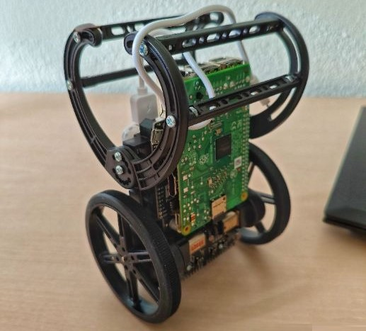
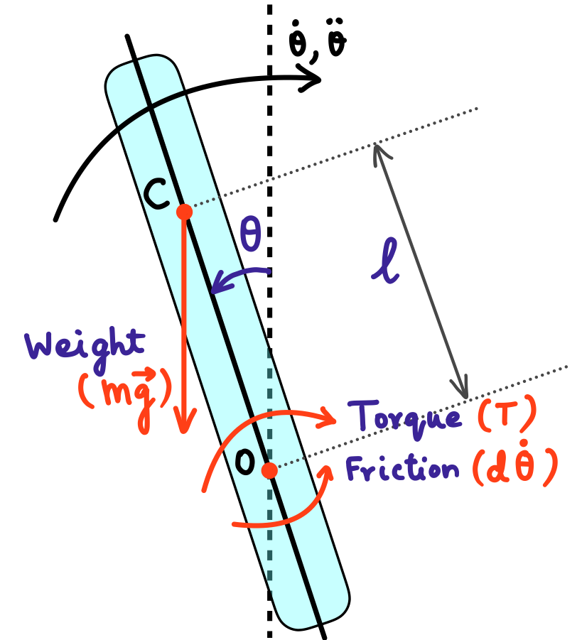
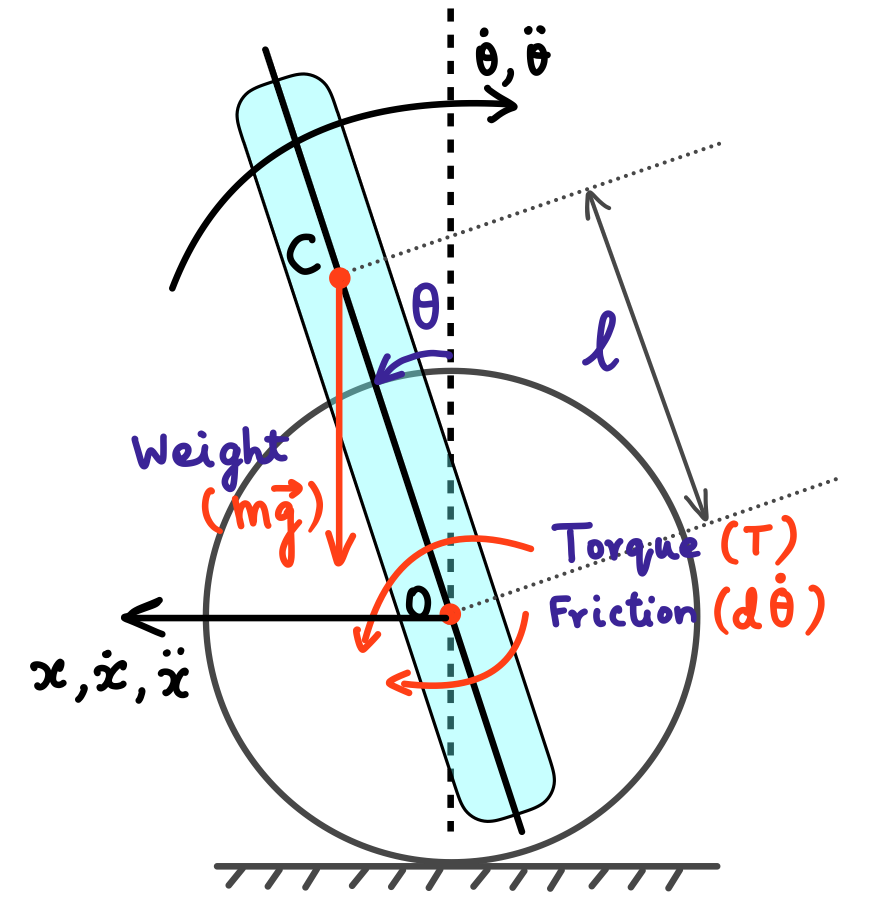

# BalanceBot
Files for the R&D project course in Polytech Nice Sophia.

### Team
Müfide GÜLEKEN and Nithish Krishnabharathi GNANI

## The robot
 Sigi is an inverted pendulum on wheels developed at the Institute for Dynamic Systems and Control (IDSC), ETH Zurich:

## Code 
* DOF1_Inverted_Pendulum_Params.m - MATLAB code for the parameters for the inverted pendulum model. This should be run before running the simulation.
* DOF1_Inverted_Pendulum_Simulation.m - Simulink code for the inverted pendulum model simulation. This should be run after running the parameters code.
* DOF2_Simulation.m - MATLAB code for the simulation of the 2 DOF translational system. The parameters for this is included in the script. It uses ode45 for the simulation.
* LQR_Calc_Sigi2D.m - MATLAB code for the LQR controller design for the 2 DOF translational system. This is a function that is used in the DOF2_Simulation.m code. This is called automatically.

The forces and moments acting on the 1-DOF inverted pendulum:  

The forces and moments acting on the 2-DOF translating robot:  
 